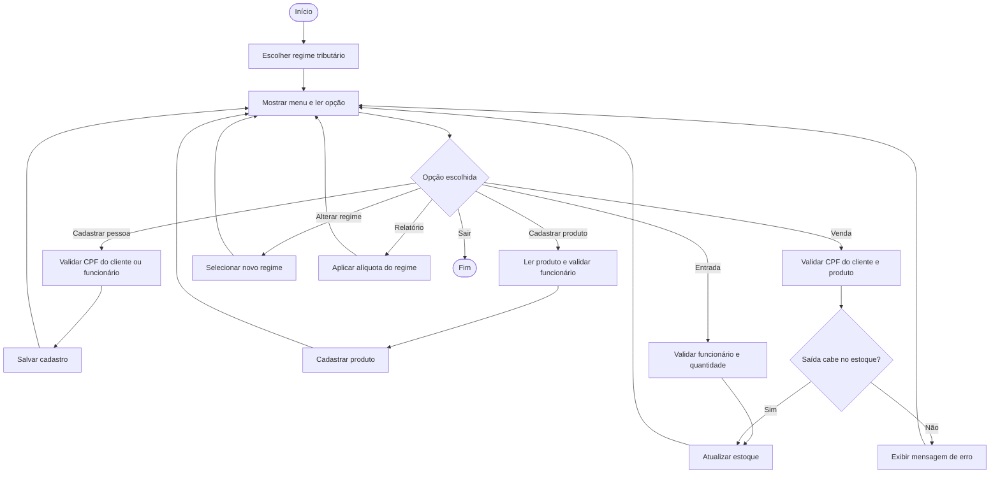

# Projeto Integrador — Sistema de Gerenciamento de Estoque Tributável

## Contexto

Pequenos comércios precisam controlar a quantidade de seus produtos e conhecer o valor financeiro mantido no estoque. Quando os itens possuem tributação, também é útil estimar a carga tributária conforme o regime escolhido pela empresa. O sistema organiza essas informações pelo terminal, sem depender de interface gráfica ou banco de dados.

## Objetivos

1. Cadastrar e listar funcionários, clientes e produtos.
2. Exigir um funcionário cadastrado como responsável pelo cadastro e pelas entradas de produtos.
3. Registrar saídas/vendas somente para clientes cadastrados.
4. Alertar quando um item alcança seu estoque mínimo.
5. Escolher ou alterar o regime tributário: Simples Nacional, Lucro Presumido ou Lucro Real.
6. Calcular valor do estoque, tributos estimados e total com tributos conforme o regime selecionado.
7. Impedir que erros de digitação deixem o estoque em situação inválida.

## Diferencial

Além do controle de quantidade, cada posição dos vetores de produto fica associada ao código do funcionário que realizou o cadastro. Entradas também exigem identificação do funcionário, enquanto saídas/vendas exigem um cliente válido identificado pelo CPF. A mesma loja pode ser simulada nos três regimes tributários. A carga estimada muda imediatamente no relatório quando o regime é alterado. O projeto é procedural e usa vetores, variáveis e métodos `static`, sem POO.

## Regimes tributários da simulação

| Opção | Regime | Alíquota estimada usada no projeto |
| --- | --- | --- |
| 1 | Simples Nacional | 6,00% |
| 2 | Lucro Presumido | 11,33% |
| 3 | Lucro Real | 15,00% |

> As alíquotas são valores didáticos para comparar os cenários no projeto. O cálculo tributário oficial varia conforme atividade, faturamento, localidade e legislação vigente.

## Regras de negócio

| Regra | Comportamento do sistema |
| --- | --- |
| Código | 3 a 20 caracteres; somente letras, números e hífen; único no cadastro. |
| Código de funcionário | Formato `FUN-001` até `FUN-999999`; único. |
| CPF do cliente | Aceita somente `12345678909`; valida os 11 dígitos e os verificadores; único. |
| Funcionário | Deve existir antes de cadastrar um produto ou registrar uma entrada. |
| Cliente | Deve existir antes de registrar uma saída/venda. |
| Opções do menu | Aceitam apenas um algarismo de `0` a `9`; valores como `10` ou texto são bloqueados. |
| Preço | Positivo e com até duas casas decimais. |
| Regime tributário | Deve ser Simples Nacional, Lucro Presumido ou Lucro Real. |
| Quantidades | Nunca podem ser negativas; entrada e saída devem ser maiores que zero. |
| Saída | Não pode ultrapassar o estoque disponível. |
| Tributo estimado | `(valor total do estoque × alíquota do regime) ÷ 100`. |

## Fluxo principal (pseudocódigo)

```text
INÍCIO
  enquanto opção for diferente de 0
    escolher regime tributário
    mostrar menu
    ler opção
    se opção = cadastrar funcionário ou cliente
      ler e validar os dados da pessoa
      impedir código repetido
      salvar cadastro
    senão se opção = cadastrar produto
      ler dados do produto
      validar funcionário responsável
      validar dados e código único
      cadastrar produto
    senão se opção = entrada
      validar funcionário responsável
      localizar produto pelo código
      validar quantidade
      atualizar estoque
    senão se opção = saída/venda
      validar CPF do cliente
      localizar produto pelo código
      validar quantidade
      se saída for maior que estoque
        informar erro
      senão
        atualizar estoque
    senão se opção = alterar regime
      ler e validar novo regime
      atualizar regime da loja
    senão se opção = relatório
      somar valores e aplicar a alíquota do regime selecionado
      exibir totais
    fim se
  fim enquanto
FIM
```

## Fluxograma



O fluxo mostra que o sistema só atualiza o estoque depois de validar os dados.
Assim, uma saída maior que a quantidade disponível volta ao menu sem modificar o produto.

## Como demonstrar na apresentação

1. Escolha `Simples Nacional`, cadastre `FUN-001` e depois o cliente com CPF fictício `12345678909`.
2. Cadastre um produto com preço `20,00`, quantidade `10` e funcionário responsável `FUN-001`.
3. Registre uma venda de `3` unidades para o CPF `12345678909` e mostre que o estoque passa para `7`.
4. Mostre o relatório: a tributação usa o regime escolhido e informa o total de clientes e funcionários.
5. Digite `10` como opção do menu: o sistema deve bloquear porque aceita somente um dígito.
6. Tente retirar uma quantidade maior que o estoque: o sistema deve bloquear e manter o estoque correto.
7. Execute `Main --teste` para apresentar os testes de validação do programa procedural.
