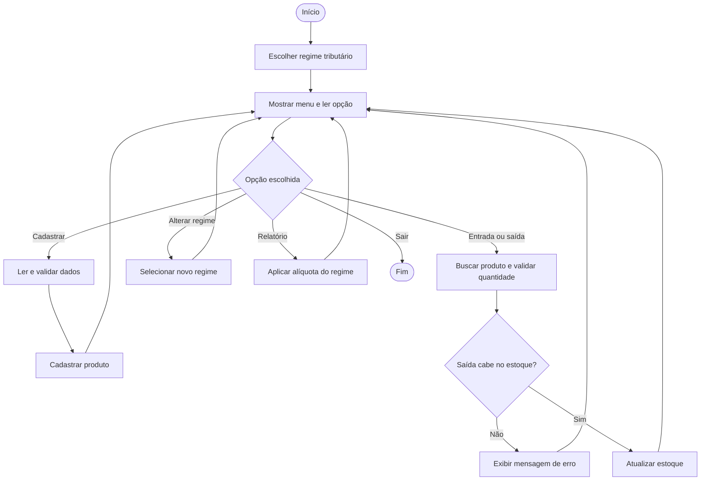

# Projeto Integrador — Sistema de Gerenciamento de Estoque Tributável

## Contexto

Pequenos comércios precisam controlar a quantidade de seus produtos e conhecer o valor financeiro mantido no estoque. Quando os itens possuem tributação, também é útil estimar a carga tributária conforme o regime escolhido pela empresa. O sistema organiza essas informações pelo terminal, sem depender de interface gráfica ou banco de dados.

## Objetivos

1. Cadastrar produtos e impedir códigos repetidos.
2. Registrar entradas e saídas de forma segura.
3. Alertar quando um item alcança seu estoque mínimo.
4. Escolher ou alterar o regime tributário: Simples Nacional, Lucro Presumido ou Lucro Real.
5. Calcular valor do estoque, tributos estimados e total com tributos conforme o regime selecionado.
6. Impedir que erros de digitação deixem o estoque em situação inválida.

## Diferencial

Além do controle de quantidade, a mesma loja pode ser simulada nos três regimes tributários. A carga estimada muda imediatamente no relatório quando o regime é alterado. O projeto também usa `BigDecimal` para valores financeiros — evitando imprecisões de `double` — e possui testes automatizados de robustez. Eles tentam enviar dados indevidos e confirmam que o sistema bloqueia a ação sem alterar o estoque já cadastrado.

## Regimes tributários da simulação

| Opção | Regime | Alíquota estimada usada no projeto |
| --- | --- | --- |
| 1 | Simples Nacional | 6,00% |
| 2 | Lucro Presumido | 11,33% |
| 3 | Lucro Real | 15,00% |

> As alíquotas são valores didáticos para comparar os cenários no projeto. O cálculo tributário oficial varia conforme atividade, faturamento, localidade e legislação vigente.

## Regras de negócio

| Regra | Comportamento do sistema |
| --- | --- |
| Código | 3 a 20 caracteres; somente letras, números e hífen; único no cadastro. |
| Preço | Positivo e com até duas casas decimais. |
| Regime tributário | Deve ser Simples Nacional, Lucro Presumido ou Lucro Real. |
| Quantidades | Nunca podem ser negativas; entrada e saída devem ser maiores que zero. |
| Saída | Não pode ultrapassar o estoque disponível. |
| Tributo estimado | `(valor total do estoque × alíquota do regime) ÷ 100`. |

## Fluxo principal (pseudocódigo)

```text
INÍCIO
  enquanto opção for diferente de 0
    escolher regime tributário
    mostrar menu
    ler opção
    se opção = cadastrar
      ler dados do produto
      validar dados e código único
      cadastrar produto
    senão se opção = entrada ou saída
      localizar produto pelo código
      validar quantidade
      se saída for maior que estoque
        informar erro
      senão
        atualizar estoque
    senão se opção = alterar regime
      ler e validar novo regime
      atualizar regime da loja
    senão se opção = relatório
      somar valores e aplicar a alíquota do regime selecionado
      exibir totais
    fim se
  fim enquanto
FIM
```

## Fluxograma



O fluxo mostra que o sistema só atualiza o estoque depois de validar os dados.
Assim, uma saída maior que a quantidade disponível volta ao menu sem modificar o produto.

## Como demonstrar na apresentação

1. Escolha `Simples Nacional` e cadastre um produto com preço `20,00` e quantidade `10`.
2. Mostre o relatório: valor de estoque `R$ 200,00`, tributo estimado `R$ 12,00` e total `R$ 212,00`.
3. Altere para `Lucro Presumido`: o mesmo estoque passa a ter tributo estimado de `R$ 22,66`.
4. Tente retirar `11` itens: o sistema deve bloquear e informar estoque insuficiente.
5. Consulte o produto e mostre que a quantidade continua `10`.
6. Execute `TesteSistema` para apresentar os testes automáticos.
